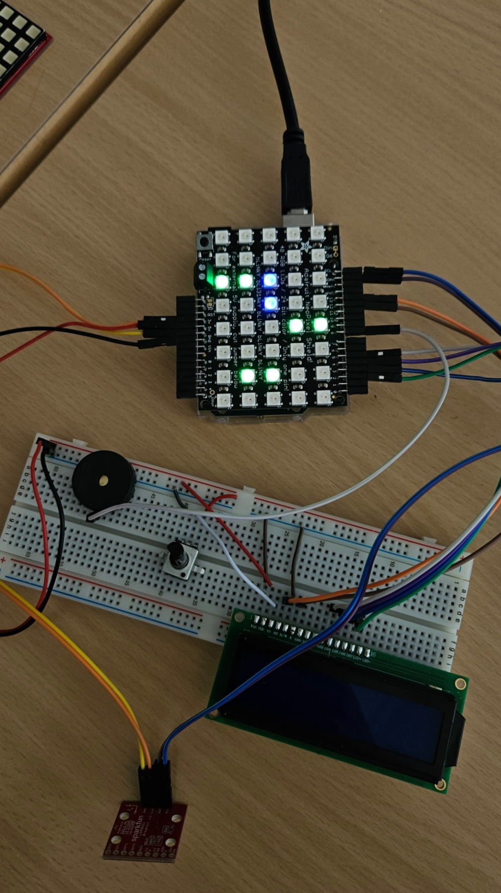

# DoodleJump Arduino

[Lien de la vidéo Youtube montrant le jeu](https://youtube.com/shorts/3NgCZ-Ar33k)

Réalisé par Lucas Tschaler  
Option Arduino 2025 – HEIG-VD, COMEM+

---

## Description

Mon projet est un jeu de type Doodle Jump. Le but est simple :
Le joueur doit diriger un personnage sur des plateformes sans tomber dans le vide. Le personnage saute automatiquement, le joueur peut simplement déplacer le personnage de gauche à droite. Dès que le personnage touche une plateforme, le score augmente. Le nombre de plateformes est infini.

Voici les composants utilisés pour réaliser le jeu :

- Carte Arduino Uno R3
- Matrice de LED RGB 5x8 (Adafruit NeoPixel Shield)
- Accéléromètre (Sparkfun LSM9DS1)
- Ecran LCD : pour l'affichage du score
- Buzzers magnétiques

L'affichage du jeu se fait sur la matrice de LEDs. Le personnage est représenté par deux pixels verticales bleues et les plateformes sont deux pixels horizontales vertes. Le score ainsi que le meilleur score sont affichés sur l'écran LCD en fin de partie.

Pour déplacer le personnage de gauche à droite, le joueur utilise l'accéléromètre.
J'ai essayé plusieurs contrôleurs : deux boutons ou avec un joystick. L'accéléromètre étant le plus fun et dynamique à utiliser, j'ai opté pour celui-ci. Par contre, il peut rendre le jeu plus compliqué.

### Fin de partie

Lorsque le personnage tombe et sort de la matrice, le jeu se termine. Pour le game over, un smiley pas content apparaît en rouge et une mélodie se joue. Si le joueur a battu le record, un smiley souriant s'affiche sur la matrice en jaune et une mélodie de victoire est jouée. Le meilleur score est enregistré sur la mémoire EEPROM de l'Arduino.

## Documentation

Retrouvez la documentation dans le dossier [docs](docs/).
