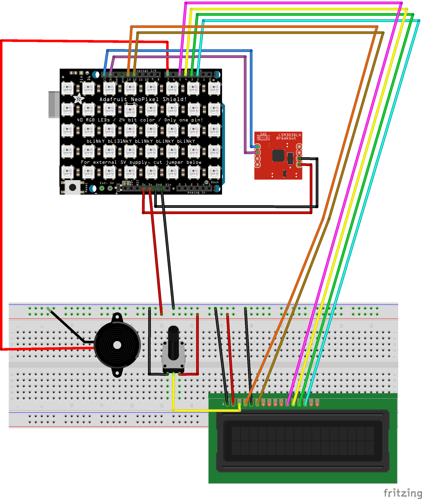

# Documentation

## Recherche et conception

Mon inspiration première est venue du jeu [Doodle Jump](https://en.wikipedia.org/wiki/Doodle_Jump) original sorti en 2009 d'abord sur iOS et développé par le Lima Sky.

J'ai, par la suite, cherché des Doodle Jump développés avec une carte Arduino et ai trouvé un jeu fait sur Arduino Nano avec une matrice de LED 8x8 par [Bruno R. Nunes](https://github.com/brnunes/Arduino-Doodle-Jump/). 

## Circuit électronique

### Schéma



### BOM

Voici les composants utilisés pour réaliser le jeu :

| Composant                         | Quantité | Description                                                  | Fournisseur / Lien                                           |
| --------------------------------- | -------- | ------------------------------------------------------------ | ------------------------------------------------------------ |
| Arduino Uno R3                    | 1        | Microcontrôleur ATmega328P                                   | [Arduino](https://store.arduino.cc/products/arduino-uno-rev3) |
| Platine de connexion sans soudure | 1        | Plaque de prototypage                                        | [Distrelec](https://www.distrelec.ch/fr/platine-de-connexion-sans-soudure-830-holes-velleman-vtbb1n/p/30260966?trackQuery=breadboard&pos=5&origPos=19&origPageSize=50&track=true&sid=qk2TEXjtjZ&itemList=search) |
| Matrice de LED RGB 5x8            | 1        | Directement branchée sur la carte Arduino - Affichage du jeu | [Adafruit](https://www.adafruit.com/product/1430)            |
| Accéléromètre                     | 1        | Sparkfun LSM9DS1 (3.3V) - Contrôle du personnage             | [Sparkfun](https://learn.sparkfun.com/tutorials/lsm9ds1-breakout-hookup-guide/all) |
| Ecran LCD                         | 1        | Alphanumeric LCD (16x2 characters) - Affichage des scores    |                                                              |
| Piezo capsule                     | 1        | PKM22EPP-40 - Son                                            | [Mouser Electronics](https://www.mouser.ch/ProductDetail/Murata-Electronics/PKM22EPP-40S1-B0?qs=KKWzfxBboQ3UGya49Xmz0w%3D%3D) |

## Programme

Le programme est composé de trois classes et d'un main.

### Classe Character

Gestion du personnage, de ses déplacements, sauts sur les plateformes. Elle contient aussi les paramètres de la matrice de LED. Les librairies utilisées pour la matrice sont : ```<Adafruit_NeoMatrix.h>```, ```<Adafruit_NeoPixel.h>``` et ```<Adafruit_GFX.h>```

### Classe PlatformManager

Gestion des plateformes, de leur affichage, de leur apparition et du son lorsque le personnage les touche. Elle a besoin de la classe Character pour fonctionner.

### Classe Game

Gestion du déroulement du jeu ainsi que du score. Elle a besoin des deux classes ci-dessus pour fonctionner ainsi que la classe permettant le contrôle de l'accéléromètre ```<SparkFunLSM9DS1.h>```, la gestion de l'écran LCD ```<LiquidCrystal.h>```  ainsi que la mémoire EEPROM concertant le meilleur score ```<EEPROM.h>```. Cette classe contient la méthode ```setup()```et ```loop()``` qui est appelée dans le main pour faire tourner le jeu.


## Roadmap

### Structure du code

La structure du code pourrait être améliorée en créant de nouvelles classes. Par exemple, pour la gestion de la matrice. Le code pourrait aussi certainement être optimisé pour être plus lisible et encore moins redondant. 

### Composant

Un composant permettant la lecture et l'écriture sur une mémoire externe pourrait être intéressant. Actuellement, le stockage du meilleur score se fait sur l'EEPROM de l'Arduino ce qui n'est pas l'idéal.   

### Amélioration du jeu

Une amélioration du gameplay pourrait être de faire en sorte que le personnage puisse passer d'un côté de la matrice à l'autre au lieu d'être bloqué d'un côté. Cela pourrait rendre le jeu plus dynamique. 

Concernant le score, il pourrait y avoir des "objets", par exemple sous forme de pixel jaune représentant des pièces, à récupérer pour augmenter le score.

